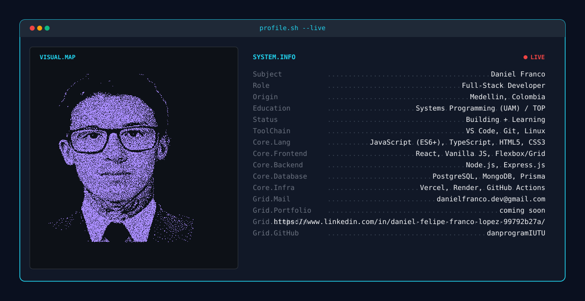

<picture>
  <source media="(prefers-color-scheme: dark)" srcset="dark.svg">
  <source media="(prefers-color-scheme: light)" srcset="light.svg">
  
</picture>

  

<!-- Streak Stats (Ancho completo 100%) -->

  

<!-- Stats Cards & Top Languages Side-by-Side (Width 49% cada una) -->

  
  

  

<!-- Contribution Snake Animation -->
<picture>
  <source media="(prefers-color-scheme: dark)" srcset="https://raw.githubusercontent.com/danprogramIUTU/danprogramIUTU/output/github-contribution-grid-snake-dark.svg">
  <source media="(prefers-color-scheme: light)" srcset="https://raw.githubusercontent.com/danprogramIUTU/danprogramIUTU/output/github-contribution-grid-snake.svg">
  
</picture>
